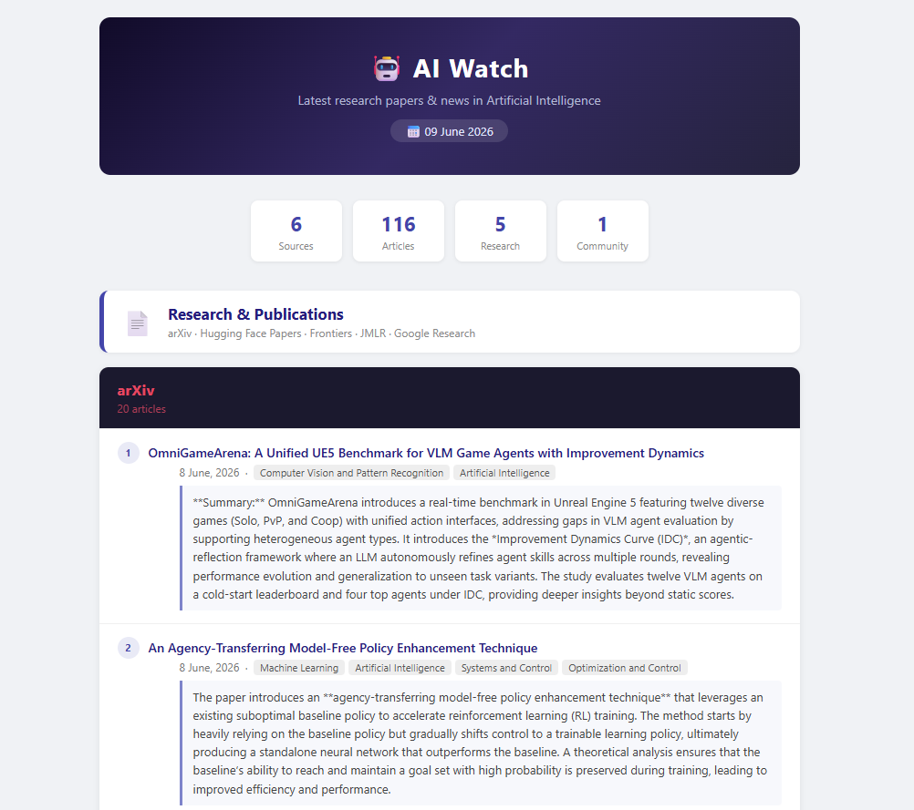

# TheWatcher: AI Research Digest



TheWatcher is an automated system that aggregates AI research from academic and community sources. It performs daily scraping of twelve distinct sources, processes content through Mistral AI for summarization, and delivers results via formatted HTML emails.

## Core Functionality

The tool operates across dual source categories. Research publications include arXiv CS preprints, Hugging Face's curated daily papers, Frontiers peer-reviewed articles, JMLR publications, and blogs from Google Research and Meta AI. Community coverage spans six newsletters via RSS: Ahead of AI, Import AI, The Gradient, Interconnects, Ben's Bites, and Last Week in AI.

## Resilience Features

Built-in exponential retry logic handles scraper failures across up to three attempts. Mistral API rate limiting is also handled with automatic retries. Users can customize item limits per source, HTTP timeouts, and retry intervals. The system preserves local HTML backups after each execution for inspection purposes.

---

## Sources

### 📄 Research and Publications
| Source | Type |
|---|---|
| [arXiv](https://arxiv.org/list/cs.AI/recent) | CS preprints |
| [Hugging Face Papers](https://huggingface.co/papers) | Daily papers, sorted by upvotes |
| [Frontiers](https://www.frontiersin.org) | Peer-reviewed AI articles |
| [JMLR](https://jmlr.org) | Journal of Machine Learning Research |
| [Google Research Blog](https://research.google/blog/) | Industry research |
| [Meta AI Blog](https://ai.meta.com/blog/) | Industry research |

### 💬 Community and News
| Source | Type |
|---|---|
| [Ahead of AI](https://magazine.sebastianraschka.com) | Newsletter (RSS) |
| [Import AI](https://importai.substack.com) | Newsletter (RSS) |
| [The Gradient](https://thegradient.pub) | Newsletter (RSS) |
| [Interconnects](https://www.interconnects.ai) | Newsletter (RSS) |
| [Ben's Bites](https://www.bensbites.com) | Newsletter (RSS) |
| [Last Week in AI](https://lastweekin.ai) | Newsletter (RSS) |

---

## Setup

### 1. Install dependencies

```bash
pip install -r requirements.txt
```

### 2. Configure

Edit `config.py`:

```python
MISTRAL_API_KEY = "your_mistral_api_key"

SMTP_HOST = "smtp-relay.brevo.com"
SMTP_PORT = 587
SMTP_USER = "your_brevo_smtp_user"
SMTP_PASS = "your_brevo_smtp_password"
MAIL_FROM = "you@example.com"
MAIL_TO   = "you@example.com"
```

> **SMTP**: the project uses [Brevo](https://www.brevo.com) (free tier: 300 emails/day).  
> **Mistral API**: get your key at [console.mistral.ai](https://console.mistral.ai).

### 3. Run

```bash
# Full run — scrape + summarize + send email
python main.py

# Scrape only, no Mistral summaries (faster)
python main.py --no-summary

# Generate HTML locally, do not send email
python main.py --no-mail

# Both flags combined
python main.py --no-summary --no-mail
```

---

## Project Structure

```
TheWatcher/
├── config.py          # All settings (API keys, SMTP, sources, limits)
├── main.py            # Orchestrator
├── summarizer.py      # Mistral AI summarization
├── email_builder.py   # HTML email template
├── requirements.txt
└── scrapers/
    ├── __init__.py
    ├── arxiv.py
    ├── huggingface.py
    ├── frontiers.py
    ├── jmlr.py
    ├── google_research.py
    ├── meta_ai.py
    └── rss_feeds.py
```

---

## Configuration Reference

| Variable | Default | Description |
|---|---|---|
| `MAX_ITEMS_PER_SOURCE` | `20` | Max articles per research source |
| `MAX_ITEMS_PER_FEED` | `4` | Max articles per newsletter feed |
| `MISTRAL_MODEL` | `mistral-small-latest` | Mistral model used for summaries |
| `REQUEST_TIMEOUT` | `15` | HTTP timeout in seconds |
| `RETRY_MAX` | `3` | Max retry attempts per source |
| `RETRY_DELAY` | `5` | Initial retry delay in seconds (doubles each attempt) |

### Enabling / disabling sources

```python
SOURCES_RESEARCH = {
    "arxiv":           True,   # set to False to skip
    "huggingface":     True,
    "frontiers":       True,
    "jmlr":            True,
    "google_research": True,
    "meta_ai":         True,
}
```

### Adding a newsletter feed

```python
RSS_FEEDS = [
    ("My Newsletter", "https://mynewsletter.com/feed"),
    # ...
]
```

---

## Scheduling (Windows)

Run automatically every morning using Task Scheduler:

```
Program  : python
Arguments: C:\path\to\TheWatcher\main.py
Start in : C:\path\to\TheWatcher\
Trigger  : Daily at 07:00
```

---

## Security Note

`config.py` contains sensitive credentials. **Never commit it to a public repository.**  
It is already listed in `.gitignore`.
